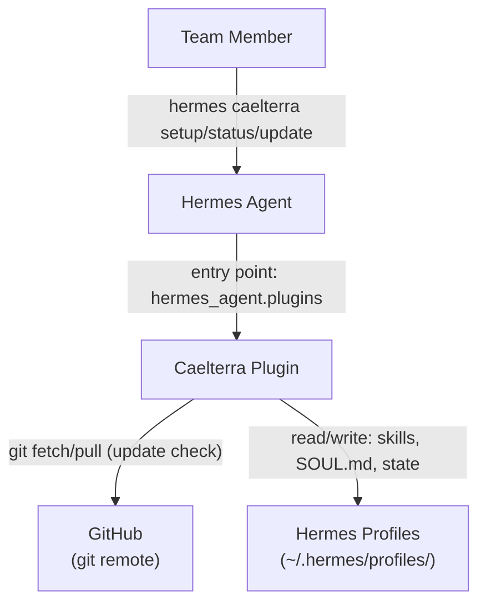
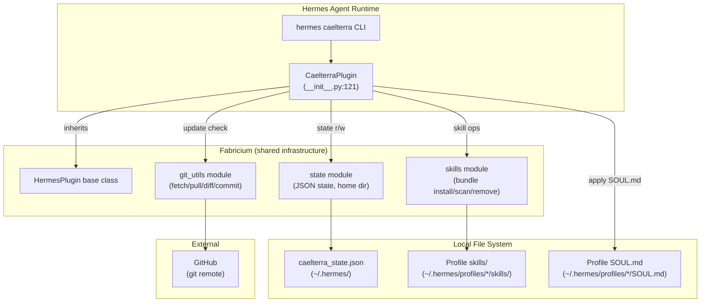

# Architecture

## System Context (C4 Level 1)



- **User**: Team member running CLI commands
- **Hermes Agent**: Plugin host runtime — loads Caelterra via pip entry point
- **Caelterra Plugin**: Manages bundled skill distribution, multi-profile setup, and self-updating
- **GitHub**: External dependency for version checking and self-update (`git fetch`/`git pull --ff-only`)
- **Hermes Profiles**: Local filesystem — skills installed here, SOUL.md applied here, `caelterra_state.json` tracks status

## Container Diagram (C4 Level 2)



## Data Flow: `caelterra update`

1. **Dirty check** — `git_utils` verifies no uncommitted changes
2. **Fetch** — `git fetch origin` via `git_utils.fetch_remote()`
3. **Ahead/behind** — `git_utils.get_ahead_behind()`; if up-to-date, still re-syncs skills
4. **Pull** — `git pull --ff-only` via `git_utils.pull_branch()`
5. **Stale detection** — `skills.get_bundled_skill_names()` vs `caelterra_state.json` → identifies orphaned skills
6. **Skill install** — `skills.install_bundled_skills()` to each profile's `skills/` directory
7. **SOUL.md sync** — If profile had `soul_md: true`, writes `SOUL.md` from plugin bundle
8. **State update** — Write updated `caelterra_state.json` with new timestamps

## Data Flow: `caelterra setup`

1. **Profile discovery** — Scans `~/.hermes/profiles/` for existing configs
2. **Auto-detect default** — If `~/.hermes/config.yaml` exists, adds `default` profile to state
3. **Interactive** (TTY) or **auto-select** (non-TTY) — User picks profiles and mode (Skills only / Skills + SOUL.md)
4. **Install** — Writes bundled skills + optionally SOUL.md per selected profile
5. **State persist** — Records mode + timestamp in `caelterra_state.json`

## Architectural Decisions

| Decision | Rationale | Status |
|----------|-----------|--------|
| Multi-profile mode (`default_profile=None`) | Team members may have multiple Hermes profiles; each should receive skills independently | Active |
| Auto-detect `default` profile on update | Users who never ran `caelterra setup` still get synced; reduces onboarding friction | Active |
| Self-bootstrap fabricium on import | Hermes may recreate its venv during updates, dropping plugin deps; auto-install ensures plugin remains functional | Active |
| `git_utils.py` as re-export shim | Git utilities migrated to shared `fabricium` library; shim preserves backward-compatible imports | Active |
| Fabricium as runtime dependency | Extracted shared Hermes plugin patterns (state, skills, git utils, testing fixtures) to avoid duplication across plugins | Active |
| Pip entry point distribution (`hermes_agent.plugins`) | Cleaner than directory-based install; zero-config discovery by Hermes; works with `hermes plugins enable` | Active |
| `caelterra_state.json` in `~/.hermes/` | Single source of truth for per-profile installation status; survives plugin re-installs | Active |
| Non-TTY fallback for interactive prompts | Enables headless CI and scripted installs; defaults auto-select all profiles | Active |

## Deployment

Caelterra is distributed as a pip package via PyPI:

```bash
pip install caelterra && hermes plugins enable caelterra
```

- **Build**: `hatchling` (PEP 621) via `uv build`
- **Publish**: PyPI trusted publisher on git tag
- **Self-update**: `hermes caelterra update` uses `git pull --ff-only` from the repo's git remote

## How to Update

- New service/external dependency? → Add to System Context diagram
- Changed data flow? → Update Data Flow sections
- New architectural decision? → Add row to Architectural Decisions table
- Container restructured? → Update Container Diagram

## Find It Fast

```bash
grep -r "class.*Plugin" src/caelterra/         # Plugin class definition
grep -r "def _sync\|def _setup\|def _update" src/caelterra/  # CLI handler methods
grep -r "caelterra_state.json" src/caelterra/  # State file references
```
